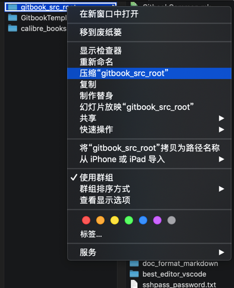
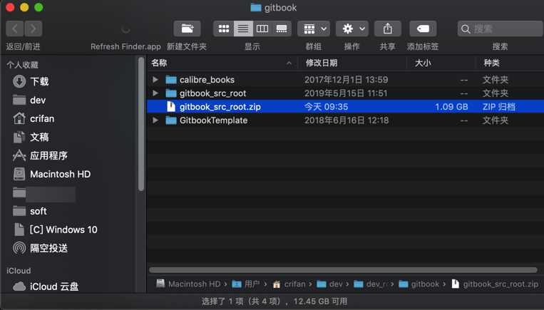
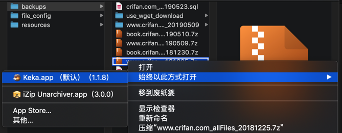
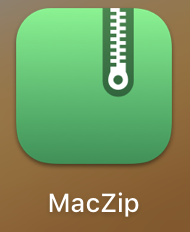

# Mac

## zip

zip工具：

* Mac自带
  * 用法：
    * 文件或文件夹 -> 右键 -> 压缩xxx
      * 
    * 压缩后会自动打开对应zip所在目录
      * 
* `iZip Unarchiver`
  * 
* `Keka`

## 7z

7z工具：
* GUI图形界面工具
  * `Keka`
    * 
    * 用法
      * 右键`7z`文件，可以用`Keka`去打开（自动开始解压缩）
        * 
  * `MacZip`
    * 旧称：`eZip`
    * logo
      * 
    * 官网
      * MacZip - 专为 macOS 而设计的压缩软件！
        * https://ezip.awehunt.com/
    * 特点
      * 支持超过 20 种压缩格式
        * 支持 rar, zip, 7z, tar, gz, bz2, iso, xz, lzma, apk, lz4 等超过 20 种常见压缩格式
      * 完美处理加密解密、中文乱码等问题
* 命令行工具
  * `p7zip`
    * 安装：
        ```bash
        brew install p7zip
        ```
      * 安装后，命令行工具名是：`7z`
        ```bash
        > which 7z
        /usr/local/bin/7z
        ```
      * 后来发现也有`7za`
        ```bash
        > which 7za
        /usr/local/bin/7za
        ```
    * 使用方法详见后续章节
      * [7z命令行工具使用总结](../../usage/7z.md)
